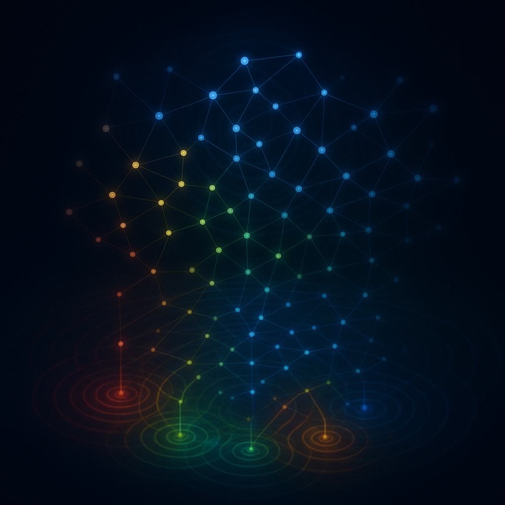

# Wavelet

A high-performance, graph-based stream processing runtime for Rust.



## Overview

Wavelet is designed for applications that need predictable, low-latency stream processing without the overhead of async
runtimes or actor systems. Built around a computation graph where nodes represent stream processors and edges define
data dependencies, wavelet provides:

- **Deterministic execution** - Same inputs always produce the same execution order
- **Dependency-ordered processing** - Guaranteed that parent nodes are always processed before their children
- **Event integration** - Unified I/O, timer, and yield event handling
- **Dependency injection** - Build-time configuration for different environments

## Quick Start

Add wavelet to your `Cargo.toml`:

```toml
[dependencies]
wavelet = "0.1"
```

Create a simple stream processing graph:

```rust
use wavelet::prelude::*;
use std::time::Duration;

fn main() -> Result<(), Box<dyn std::error::Error>> {
    let runtime = Runtime::builder()
        .with_clock(PrecisionClock::new())
        .with_mode(Sleep::new(Duration::from_millis(1)))
        .build()?;

    // Create a data source
    let source = NodeBuilder::new(0u64)
        .on_init(|executor, _, idx| {
            executor.yield_driver().yield_now(idx);
        })
        .build(runtime.executor(), |counter, _ctx| {
            *counter += 1;
            println!("Source: {}", counter);
            Control::Broadcast
        });

    // Create a processor that reacts to the source
    let _processor = NodeBuilder::new(String::new())
        .triggered_by(&source)
        .build(runtime.executor(), |state, _ctx| {
            *state = format!("Processed: {}", source.borrow());
            println!("{}", state);
            Control::Unchanged
        });

    // Run the graph
    runtime.run_forever();
}
```

## Architecture

**Relationships**: Define how nodes interact in the computation graph. `Trigger` relationships cause immediate
downstream execution when a node broadcasts changes, while `Observe` relationships create dependencies without automatic
propagation, allowing nodes to inspect upstream state on-demand.

### Core Concepts

**Node**: A computational unit that processes data from upstream nodes and optionally propagates results downstream.
Nodes can perform transformations, aggregations, filtering, side effects, or any custom business logic.

**Relationships**: Define how nodes interact in the computation graph. `Trigger` relationships cause immediate
downstream execution when a node broadcasts changes, while `Observe` relationships create dependencies without automatic
propagation, allowing nodes to inspect upstream state on-demand.

**Cooperative Scheduling**: Multi-depth scheduling system that processes nodes in dependency order. Nodes execute
atomically and return control to the scheduler, which ensures proper execution sequencing and prevents infinite loops
through epoch-based deduplication.

**Event System**: External event integration that drives graph execution. I/O events (network, file operations), timer
events (scheduled execution), and yield events (immediate re-scheduling) all feed into the scheduler to trigger node
processing cycles.

### Key Components

```rust, ignore
// Build a computation graph
let processor = NodeBuilder::new(State::new())
    .triggered_by(&data_source)     // Execute when source changes
    .observer_of(&config_node)      // Read config but don't auto-execute
    .with_name("processor".into())
    .build(&mut executor, |state: &mut State, ctx: &mut ExecutionContext| {
        // Process data with mutable access to state
        state.process(data_source.borrow().latest_data());
        Control::Broadcast  // Notify downstream nodes
    });
```

## Features

Wavelet uses Cargo features to enable different functionality:

- `runtime` (default) - Core execution engine including the scheduler, computation graph, event drivers (I/O, timer,
  yield), and garbage collection. This provides the fundamental stream processing capabilities.
- `factories` - Domain-specific language (DSL) primitives and dependency injection system for building complex
  computation graphs. Factories enable you to construct reusable subgraphs that return leaf nodes, with automatic
  memoization to prevent duplicate node creation. This is essential for building sophisticated topologies where the same
  subgraph patterns are reused across multiple downstream dependencies.
- `testing` - Comprehensive test utilities and mock implementations designed for unit testing individual nodes and
  entire computation graphs. Includes test clocks and mock event sources for validating node behavior in isolation.
- `channel` - Cross-thread communication infrastructure using lock-free ring buffers (crossbeam's ArrayQueue) integrated
  with mio notifications (Notifier). This enables external threads and systems to inject data into the computation graph
  safely and efficiently.
- `full` - Convenience feature that enables all available functionality. Equivalent to enabling runtime, factories,
  testing, and channel features simultaneously.

```toml
[dependencies]
wavelet = { version = "0.1.3", features = ["full"] }
```

### Dependency Injection with Factories

Wavelet's factory system enables environment-specific implementations while maintaining identical graph topology.
Factories provide build-time dependency injection, allowing you to swap implementations based on configuration without
changing your core processing logic.

#### Simple Factory Usage

```rust, ignore
use wavelet::factories::*;

// Configure different data sources per environment
let data_source = match environment {
    Environment::Production => KeyedFactory::default()
        .attach(|executor, symbol| create_live_feed(executor, symbol)),
    Environment::Test => KeyedFactory::default()
        .attach(|executor, symbol| create_mock_feed(executor, symbol)),
    Environment::Replay => KeyedFactory::default()
        .attach(|executor, symbol| create_historical_feed(executor, symbol, date_range)),
};

// Same graph construction code works with any configured factory
let eurusd_feed = data_source.get(&mut executor, "EURUSD".to_string());
let gbpusd_feed = data_source.get(&mut executor, "GBPUSD".to_string());

// Build downstream processors using the factory-created nodes
let processor = NodeBuilder::new(PriceProcessor::new())
    .triggered_by(&eurusd_feed)  // Implementation determined by factory
    .triggered_by(&gbpusd_feed)
    .build(&mut executor, process_prices);
```

#### Composable Factory Patterns

For complex topologies, compose simple factories into larger DSL structures:

```rust, ignore
struct TradingSystemFactory {
    market_data: KeyedFactory<String, MarketFeed>,
    risk_engine: KeyedFactory<String, RiskValidator>,
    order_gateway: KeyedFactory<String, OrderSender>,
}

impl TradingSystemFactory {
    fn create_trading_pair(&self, executor: &mut Executor, symbol: String) -> Node<TradingPair> {
        // Create the data pipeline using individual factories
        let feed = self.market_data.get(executor, symbol.clone());
        let risk = self.risk_engine.get(executor, "primary".to_string());
        let gateway = self.order_gateway.get(executor, symbol.clone());
        
        // Return the leaf node of this subgraph
        NodeBuilder::new(TradingPair::new(symbol))
            .triggered_by(&feed)
            .observer_of(&risk)    // Risk engine provides validation
            .observer_of(&gateway) // Gateway handles order execution
            .build(executor, |pair, ctx| {
                // Trading logic here
                Control::Broadcast
            })
    }
    
    fn for_environment(env: Environment) -> Self {
        Self {
            market_data: match env {
                Environment::Live => KeyedFactory::default()
                    .attach(|executor, symbol| LiveMarketFeed::create(executor, symbol)),
                Environment::Test => KeyedFactory::default()
                    .attach(|executor, symbol| MockMarketFeed::create(executor, symbol)),
            },
            risk_engine: KeyedFactory::default()
                .attach(|executor, _| RiskEngine::create(executor, env.risk_config())),
            order_gateway: match env {
                Environment::Live => KeyedFactory::default()
                    .attach(|executor, symbol| LiveOrderGateway::create(executor, symbol)),
                Environment::Test => KeyedFactory::default()
                    .attach(|executor, symbol| MockOrderGateway::create(executor, symbol)),
            },
        }
    }
}

// Usage: Same high-level construction, different implementations
let factory = TradingSystemFactory::for_environment(config.environment);
let eurusd_trader = factory.create_trading_pair(&mut executor, "EURUSD".to_string());
let gbpusd_trader = factory.create_trading_pair(&mut executor, "GBPUSD".to_string());
```

#### Key Benefits

- **Memoization**: Identical keys return the same cached node instance, preventing duplicate subgraph creation
- **Environment Isolation**: Test, staging, and production can use completely different implementations
- **Resource Efficiency**: Expensive resources (database connections, external APIs) are created once per key
- **Type Safety**: Factory functions are statically typed, preventing configuration errors
- **Composability**: Simple factories combine into complex domain-specific languages (DSLs)

This pattern is particularly powerful for financial systems, IoT processing pipelines, and any domain where you need to
swap data sources, validation logic, or output destinations based on runtime configuration.

## Use Cases

Wavelet excels in domains requiring deterministic, low-latency processing:

- **Financial Systems** - Trading engines, risk management, market data processing
- **Real-time Analytics** - Live dashboards, alerting, stream aggregation
- **IoT Processing** - Sensor data, device management, edge computing
- **Protocol Handling** - Stateful network protocols, message parsing

## Contributing

We welcome contributions! Please see [CONTRIBUTING.md](CONTRIBUTING.md) for guidelines.

## License

MIT License ([LICENSE](LICENSE))